NVIDIA Kaya
===========

Kaya is a robot developed as a platform to demonstrate the power and
flexibility of the Isaac Robot Engine running on the NVIDIA Jetson Nano
platform. It has been intentionally designed using 3D printed parts and
hobbyist components to be as accessible as possible.

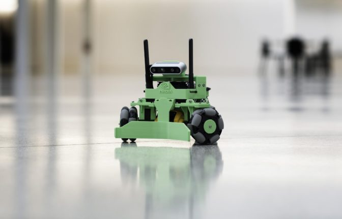

The Kaya Robot

Kaya features a three-wheeled holonomic drive which allows it to move in
any direction, regardless of where it is facing. A RealSense depth
camera allows Kaya to see the world around it in 3D, enabling features
like mapping, localization, and object recognition. An on-board IMU and
position feedback from the wheel motors provide accurate odometry
information. Power is provided via an easily-swapped and fast-charging
power tool battery. Outfitting the Jetson Nano with a Wi-Fi/Bluetooth
card allows you to interact with the robot using Isaac Sight over Wi-Fi,
and also allows you to connect a gamepad controller via Bluetooth.

Use the instructions in this section to build and operate your own Kaya
robot.

Parts
-----

For a list of 3D printed parts, and STL/STEP/IGES files for creating the parts,
see either the [`cad-files`](https://github.com/nvidia-isaac/kaya-robot/tree/master/cad-files) folder in this GitHub repository, or the [Isaac Developer
Downloads](https://developer.nvidia.com/isaac/downloads) website.

The following is a list of the off-the-shelf components needed for
building Kaya. Prices shown are approximate and subject to change by
vendors. Many of these components or suitable replacements are available
from a wide variety of sources, which you are encouraged to explore.

<table>
<thead>
<tr class="header">
<th><strong>PART NAME</strong></th>
<th><strong>VENDOR PART #</strong></th>
<th><strong>SOURCE</strong></th>
<th><strong>QTY</strong></th>
<th><strong>APPROX COST</strong></th>
</tr>
</thead>
<tbody>
<tr class="odd">
<td>3D Printed Parts</td>
<td>-</td>
<td><em>See 3D Printed Parts List</em></td>
<td>-</td>
<td>-</td>
</tr>
<tr class="even">
<td>NVIDIA Jetson Nano Developer Kit</td>
<td>945-13450-0000-000</td>
<td><a href="https://developer.nvidia.com/buy-jetson?product=jetson_nano">NVIDIA</a></td>
<td>1</td>
<td>$99.00</td>
</tr>
<tr class="odd">
<td>MicroSD Card (32GB)</td>
<td>SDSQUNC-032G-GN6MA</td>
<td><a href="https://www.amazon.com/SanDisk-microSDHC-Standard-Packaging-SDSQUNC-032G-GN6MA/dp/B010Q57T02/ref=sr_1_6?keywords=Micro+SD&amp;qid=1550688765&amp;s=gateway&amp;sr=8-6">Amazon - SanDisk</a></td>
<td>1</td>
<td>$8.00</td>
</tr>
<tr class="even">
<td>Intel Dual Band Wireless-Ac 8265 W/Bt</td>
<td>8265NGW</td>
<td><a href="https://www.amazon.com/Intel-Dual-Band-Wireless-Ac-8265/dp/B01MZA1AB2/ref=sr_1_1?keywords=intel+8265ngw&amp;qid=1553724227&amp;s=electronics&amp;sr=1-1">Amazon - Intel</a></td>
<td>1</td>
<td>$25.00</td>
</tr>
<tr class="odd">
<td>Dual Band Wi-Fi Antennas &amp; IPEX4 to RP-SMA Cables</td>
<td>CHAOHANG 6484109</td>
<td><a href="https://www.amazon.com/CHAOHANG-RP-SMA-Antenna-Soldering-Wireless/dp/B01E29566W/ref=pd_bxgy_147_img_3/143-9820515-0065716?_encoding=UTF8&amp;pd_rd_i=B01E29566W&amp;pd_rd_r=24e8099a-325b-11e9-9916-7fe6d01b346e&amp;pd_rd_w=Hz2rK&amp;pd_rd_wg=eK9tl&amp;pf_rd_p=6725dbd6-9917-451%22&amp;%22d-beba-16af7874e407&amp;pf_rd_r=0YDJ7K6AEJE56W35GHQB&amp;psc=1&amp;refRID=0YDJ7K6AEJE56W35GHQB">Amazon</a></td>
<td>1</td>
<td>$13.00</td>
</tr>
<tr class="even">
<td>Intel RealSense Depth Camera D435</td>
<td>961448</td>
<td><a href="https://click.intel.com/intelr-realsensetm-depth-camera-d435.html">Intel</a></td>
<td>1</td>
<td>$179.00</td>
</tr>
<tr class="odd">
<td>Bosch GY-BMI160 6DOF IMU Board (Generic Breakout)</td>
<td>GY-BMI160</td>
<td><a href="https://www.amazon.com/s?k=GY-BMI160">Amazon / eBay / AliExpress</a></td>
<td>1</td>
<td>$5.00</td>
</tr>
<tr class="even">
<td>Dynamixel MX-12W Servo Motor</td>
<td>902-0086-000</td>
<td><a href="http://www.robotis.us/dynamixel-mx-12w/">Robotis</a></td>
<td>3</td>
<td>$197.70</td>
</tr>
<tr class="odd">
<td>USB2AX v3.2a or U2D2</td>
<td>XE-USB2AX (for USB2AX v3.2a) or RO-902-0132-000 (for U2D2)</td>
<td><a href="https://www.trossenrobotics.com/usb2ax">Trossen Robotics USB2AX v3.2a</a> or <a href="https://www.trossenrobotics.com/dynamixel-u2d2.aspx">Trossen Robotics U2D2</a></td>
<td>1</td>
<td>$39.95 (for USB2AX v3.2a) or $49.90 (for U2D2)</td>
</tr>
<tr class="even">
<td>Dynamixel 6 Port AX/MX Power Hub</td>
<td>IL-3PHUB</td>
<td><a href="https://www.trossenrobotics.com/6-port-ax-mx-power-hub">Trossen Robotics</a></td>
<td>1</td>
<td>$7.95</td>
</tr>
<tr class="odd">
<td>VEX 3.25&quot; Omni-Directional Wheel</td>
<td>217-4775</td>
<td><a href="https://www.vexrobotics.com/omni-wheels.html">VEX Robotics</a></td>
<td>3</td>
<td>$53.97</td>
</tr>
<tr class="even">
<td>DeWALT 20V MAX 2AH Li-ion Battery</td>
<td>DCB203</td>
<td><a href="https://www.amazon.com/DEWALT-DCB203-Compact-Li-Ion-Battery/dp/B00BYKVMES/ref=pd_day0_hl_469_4/143-9820515-0065716?_encoding=UTF8&amp;pd_rd_i=B00BYKVMES&amp;pd_rd_r=3f278334-46c0-11e9-969f-a1ee2b4b46aa&amp;pd_rd_w=ntxfz&amp;pd_rd_wg=BvWaf&amp;pf_rd_p=ad07871c-e646-4161-82c7-%22&amp;%225ed0d4c85b07&amp;pf_rd_r=B544K119P03BHEB885K0&amp;psc=1&amp;refRID=B544K119P03BHEB885K0">Amazon - DeWALT</a></td>
<td>1</td>
<td>$45.00</td>
</tr>
<tr class="odd">
<td>DeWALT 20V MAX Li-ion Battery Charger</td>
<td>DCB107</td>
<td><a href="https://www.amazon.com/dp/B06X94PH92/ref=psdc_8106529011_t1_B00X6BWHA6">Amazon - DeWALT</a></td>
<td>1</td>
<td>$34.75</td>
</tr>
<tr class="even">
<td>5V 6A DC-DC Step-Down Regulator</td>
<td>D24V60F5</td>
<td><a href="https://www.pololu.com/product/2865">Pololu</a></td>
<td>1</td>
<td>$19.95</td>
</tr>
<tr class="odd">
<td>12V 5A DC-DC Step-Down Regulator</td>
<td>EA60-12V</td>
<td><a href="https://www.amazon.com/gp/product/B01LY4RANA/ref=ppx_yo_dt_b_asin_title_o00_s00?ie=UTF8&amp;psc=1">Amazon</a></td>
<td>1</td>
<td>$9.50</td>
</tr>
<tr class="even">
<td>2.1 x 5.5mm Male Barrel Plug Pigtail</td>
<td>B072BXB2Y8</td>
<td><a href="https://www.amazon.com/gp/product/B072BXB2Y8/ref=ppx_yo_dt_b_asin_title_o00_s00?ie=UTF8&amp;psc=1">Amazon</a></td>
<td>1</td>
<td>$0.94</td>
</tr>
<tr class="odd">
<td>Rocker Switch</td>
<td>7395K28</td>
<td><a href="https://www.mcmaster.com/7395k28">McMaster-Carr</a></td>
<td>1</td>
<td>$6.76</td>
</tr>
<tr class="even">
<td>Terminal Block</td>
<td>7527K44</td>
<td><a href="https://www.mcmaster.com/7527k44">McMaster-Carr</a></td>
<td>1</td>
<td>$2.24</td>
</tr>
<tr class="odd">
<td>Terminal Block Jumpers</td>
<td>7527K59</td>
<td><a href="https://www.mcmaster.com/7527k59">McMaster-Carr</a></td>
<td>2</td>
<td>$0.49</td>
</tr>
<tr class="even">
<td>Wire End/Terminal Kit</td>
<td>HC28-6</td>
<td><a href="https://www.amazon.com/Accessbuy-Insulated-Electrical-Connector-Connectors/dp/B01L3MSLO0/ref=sr_1_7?keywords=terminal+connector&amp;qid=1549832593&amp;s=industrial&amp;sr=1-7">Amazon</a></td>
<td>-</td>
<td>$10.00</td>
</tr>
<tr class="odd">
<td>18AWG Electrical Wire (Red and Black)</td>
<td>-</td>
<td><a href="https://www.amazon.com/Electrical-Gauge-Silicone-Cable-Black/dp/B0746HMTPP/ref=sr_1_6?keywords=18+awg+red+black+wire&amp;qid=1553726358&amp;s=industrial&amp;sr=1-6">Amazon</a></td>
<td>-</td>
<td>$5.00</td>
</tr>
<tr class="even">
<td>Female-Female Electrical Jumper Wires</td>
<td>-</td>
<td><a href="https://www.amazon.com/GenBasic-Solderless-Dupont-Compatible-Breadboard-Prototyping/dp/B077NH83CJ/ref=sr_1_3?crid=3AWMVM5JYO01Y&amp;keywords=female%2Bfemale%2Bjumper%2Bwires&amp;qid=1553793205&amp;refinements=p_85%3A2470955011&amp;rnid=2470954011&amp;rps=1&amp;s=electronics&amp;spre%22&amp;%22%22&amp;%22fix=female%2Bfemale%2B%2Celectronics%2C178&amp;sr=1-3&amp;th=1">Amazon</a></td>
<td>4</td>
<td>$5.00</td>
</tr>
<tr class="odd">
<td>MakerBeam 150x10x10mm Beams</td>
<td>bamb150p06</td>
<td><a href="https://www.amazon.com/MakerBeam-150x10x10mm-beam-black-anodised/dp/B00G2DNT4I">Amazon - MakerBeam</a></td>
<td>3</td>
<td>$5.00</td>
</tr>
<tr class="even">
<td>MakerBeam 25 pieces T-slot nuts inc screws</td>
<td>101619</td>
<td><a href="https://www.amazon.com/gp/product/B016OJNLJ2/ref=oh_aui_detailpage_o01_s01?ie=UTF8&amp;psc=1">Amazon - MakerBeam</a></td>
<td>-</td>
<td>$17.00</td>
</tr>
<tr class="odd">
<td>M3 18mm threaded standoff</td>
<td>95947A525</td>
<td><a href="https://www.mcmaster.com/95947a525">McMaster-Carr</a></td>
<td>3</td>
<td>$3.66</td>
</tr>
<tr class="even">
<td>M3 x 35mm Socket Head Screw</td>
<td>91292A033</td>
<td><a href="https://www.mcmaster.com/91292a033">McMaster-Carr</a></td>
<td>3</td>
<td>$3.54</td>
</tr>
<tr class="odd">
<td>M3 x 8mm Socket Head Screw</td>
<td>91292A112</td>
<td><a href="https://www.mcmaster.com/91292a112">McMaster-Carr</a></td>
<td>-</td>
<td>$4.29</td>
</tr>
<tr class="even">
<td>M3 x 5mm Socket Head Screw</td>
<td>91292A110</td>
<td><a href="https://www.mcmaster.com/91292a110">McMaster-Carr</a></td>
<td>-</td>
<td>$4.72</td>
</tr>
<tr class="odd">
<td>M3 Hex Nuts</td>
<td>90591A250</td>
<td><a href="https://www.mcmaster.com/90591a250">McMaster-Carr</a></td>
<td>-</td>
<td>$2.21</td>
</tr>
<tr class="even">
<td>M2 x 6mm Phillips Screw</td>
<td>92010A003</td>
<td><a href="https://www.mcmaster.com/92010a003">McMaster-Carr</a></td>
<td>-</td>
<td>$4.39</td>
</tr>
<tr class="odd">
<td>
</td>
<td></td>
<td></td>
<td></td>
<td><strong>$812.87</strong></td>
</tr>
</tbody>
</table>

Dynamixel U2D2 & USB2AX Interchangeability
------------------------------------------

To communicate with the Dynamixel servo motors, either the USB2AX or
U2D2 serial converters may be used. (The U2D2 converter is available as
[Trossen Robotics
RO-902-1032-000](https://www.trossenrobotics.com/dynamixel-u2d2.aspx)
for $49.90. Price is approximate and subject to change by the vendor.)

You must specify the USB device name of the converter in the `usb_port`
parameter of the isaac.KayaBaseDriver component API so that your
application can communicate with it. For the Kaya sample applications
included in Isaac SDK, this is found in
`\apps\kaya\robots\kaya_v<version>.config.json`. In the following
example, the U2D2 serial converter is specified.

    {
       "kaya_driver": {
          "isaac.KayaBaseDriver": {
             "usb_port": "/dev/ttyUSB0"
          }
       }
    }

The devices have the following USB device names.

-   USB2AX: ttyACM0
-   U2D2: ttyUSB0

See the Component API section of this documentation describing
isaac.KayaBaseDriver for more information.

Wiring Diagram
--------------

See below for a wiring diagram for the Kaya robot. You may find it
useful to reference this during the assembly process. Click for a larger
version.

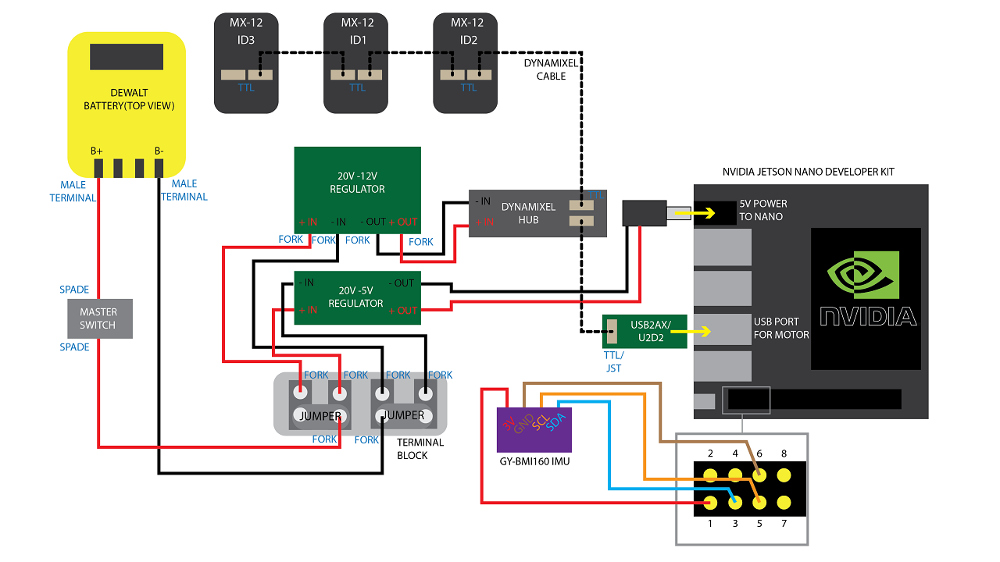

Wiring Diagram for the Kaya Robot

Assembly Instructions
---------------------

This section describes step-by-step assembly of the Kaya robot.

The underscore-delimited names that appear in parentheses in the steps
below are the names of the 3D-printed parts. See "Parts" section for links
to that list.

**1 Assign IDs to the Dynamixel Motors**

When first purchased, the Dynamixel motors are all be assigned ID “1,”
and must be assigned unique IDs and properly configured before being
connected together on Kaya. This procedure requires a USB serial adapter
(USB2AX or U2D2), an external 12V power source (the 12V DC-DC converter
on Kaya), and a PC which on which to run the RoboPlus v1 software.

RoboPlus v2 does not work with MX-12W. See
[<http://www.robotis.us/roboplus1/>](http://www.robotis.us/roboplus1/)
to download the RoboPlus v1 application.

You can also complete this step after the rest of Kaya is assembled.
Just be aware that you should only connect one motor at a time to avoid
duplicate IDs.

To assign IDs to the motors:

1.  Start the RoboPlus v1 application.
2.  Connect the USB serial converter to the desktop.
3.  Connect each Dynamixel motor to the serial adapter.
4.  Connect the Dynamixel motor to external (12V) power.
5.  Launch Dynamixel Wizard in the RoboPlus v1 application.
6.  Open Port (top menu) to detect connected motors.
7.  Click on the correct motor, assign the ID \# below and wheel mode.
    Click Apply.

    > -   Left: ID 1
    > -   Rear: ID 2
    > -   Right: ID 3

8.  Repeat step 7 for each motor, and annotate the ID placard for each
    motor accordingly.

**2 Install Dynamixel Servo Motors (3 per Robot)**

1.  Insert 4 M2 nuts from the Dynamixel MX-12W motor kits into the
    second slot up from the horn (servo head) on all sides. Press firmly
    to secure.
2.  Install each motor into a motor bottom plate
    (Kaya\_Motor\_Bottom\_Plate) using 4 M2 screws from the Dynamixel
    MX-12W motor kits.

    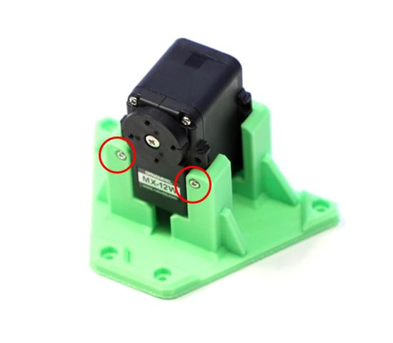

**3 Assemble the Inside Wheel Hub (3 per Robot)**

1.  Insert an 18mm M3 standoff into hex hole on the back side of the hub
    (Kaya\_Wheel\_Hub\_Inside).
2.  Using 4 M2 screws from the Dynamixel MX-12W motor kits, fasten the
    hub (Kaya\_Wheel\_Hub\_Inside) to the horn of the Dynamixel. Tighten
    evenly. Be careful not to overtighten.
3.  Repeat for each motor.

    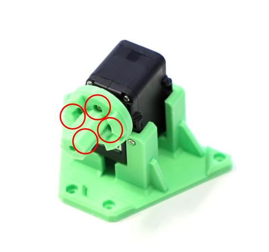

**4 Cut and Crimp Power Wiring**

1.  Cut 9 sections of 18 AWG (4 black, 5 red) wire to length and strip
    insulation from the ends (3-5mm).
2.  Attach connectors according to the table using a suitable crimping
    tool. Take care to ensure that all connectors are mechanically
    secure and make good electrical contact.

    Refer to the following image, table and the Wiring Diagram when
    cutting and crimping wiring.

    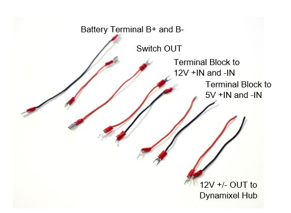

<table style="width:100%;">
<colgroup>
<col width="14%" />
<col width="14%" />
<col width="14%" />
<col width="14%" />
<col width="14%" />
<col width="14%" />
<col width="14%" />
</colgroup>
<tbody>
<tr class="odd">
<td><strong>Wire#</strong></td>
<td><strong>Color</strong></td>
<td><strong>Length</strong></td>
<td><strong>Terminal 1 Connector</strong></td>
<td><strong>Terminal 1 Connection</strong></td>
<td><strong>Terminal 2 Connector</strong></td>
<td><strong>Terminal 2 Connection</strong></td>
</tr>
<tr class="even">
<td>1</td>
<td>Black</td>
<td>140 mm</td>
<td>Male Spade</td>
<td>Battery B-</td>
<td>Fork Spade</td>
<td>Terminal Block B-</td>
</tr>
<tr class="odd">
<td>2</td>
<td>Red</td>
<td>80 mm</td>
<td>Male Spade</td>
<td>Battery B+</td>
<td>Female Spade</td>
<td>Switch IN</td>
</tr>
<tr class="even">
<td>3</td>
<td>Red</td>
<td>140 mm</td>
<td>Female Spade</td>
<td>Switch OUT</td>
<td>Fork Spade</td>
<td>Terminal Block B+</td>
</tr>
<tr class="odd">
<td>4</td>
<td>Black</td>
<td>120 mm</td>
<td>Fork Spade</td>
<td>Terminal Block B-</td>
<td>Fork Spade</td>
<td>12V Regulator -IN</td>
</tr>
<tr class="even">
<td>5</td>
<td>Red</td>
<td>120 mm</td>
<td>Fork Spade</td>
<td>Terminal Block B+</td>
<td>Fork Spade</td>
<td>12V Regulator +IN</td>
</tr>
<tr class="odd">
<td>6</td>
<td>Black</td>
<td>120 mm</td>
<td>Fork Spade</td>
<td>Terminal Block B-</td>
<td>Bare Wire</td>
<td>5V Regulator -IN</td>
</tr>
<tr class="even">
<td>7</td>
<td>Red</td>
<td>120 mm</td>
<td>Fork Spade</td>
<td>Terminal Block B+</td>
<td>Bare Wire</td>
<td>5V Regulator +IN</td>
</tr>
<tr class="odd">
<td>8</td>
<td>Black</td>
<td>120 mm</td>
<td>Fork Spade</td>
<td>12V Regulator -OUT</td>
<td>Bare Wire</td>
<td>Dynamixel Hub -IN</td>
</tr>
<tr class="even">
<td>9</td>
<td>Red</td>
<td>120 mm</td>
<td>Fork Spade</td>
<td>12V Regulator +OUT</td>
<td>Bare Wire</td>
<td>Dynamixel Hub +IN</td>
</tr>
</tbody>
</table>

**5 Connect Battery Terminals to the Battery Holder**

1.  Place Battery terminal cables (wires \#1 and \#2) into slots in the
    battery holder (Kaya\_Battery\_Holder), paddles facing each other as
    depicted below. The B+ (red wire) should be seated in the slot
    nearest to the notch cut out of the battery holder. Push firmly on
    the top of the crimps to seat properly in the channels.

    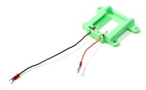

2.  Secure the cables using the terminal holder
    (Kaya\_Battery\_Terminal\_Holder) and an M3 x 8mm screw. Check
    alignment with a battery, and use pliers to adjust the paddles until
    they align and seat properly. To avoid creating an electrical short
    between the battery terminals, cover any loose wire ends with
    electrical tape.

    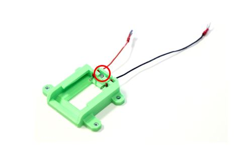

**6 Assemble the Frame**

1.  Attach each motor top plate (Kaya\_Motor\_Top\_Plate) to MakerBeams
    using 4 MakerBeam nuts and 4 M3 x 5mm screws at each corner. Slide
    MakerBeam nuts into channels first, 2 per side, and then align with
    the holes before fastening with screws.

    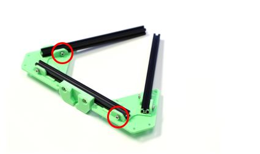

2.  Between two motor top plates (Kaya\_Motor\_Top\_Plate), install
    Kaya\_Pusher\_Mount, remembering to slide nuts into place before
    attaching the second motor top plate.
3.  Assemble the full triangle and tighten all 12 screws evenly. The
    side with the pusher mount (Kaya\_Pusher\_Mount) is the front of
    Kaya, for the purposes of the rest of this procedure.

    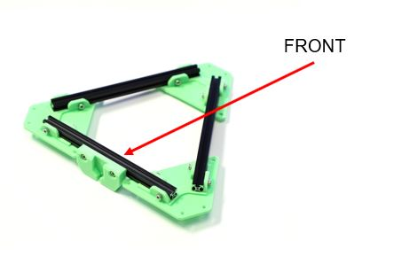

**7 Connect the Bottom Plate Assembly to the Motor Top Plate/MakerBeam
Frame**

1.  Attach each motor bottom plate (Kaya\_Motor\_Bottom\_Plate)
    assemblies to the frame in the correct configuration. The motor
    assembly tagged with Dynamixel ID 2 should sit opposite to the
    pusher mount (Kaya\_Pusher\_Mount), with the other two motor
    assemblies to the adjacent sides.
2.  Insert 4 M3 nuts into a motor bottom plate
    (Kaya\_Motor\_Bottom\_Plate), and attach to motor top plates
    (Kaya\_Motor\_Top\_Plate) with 4 M3 x 8mm screws. Repeat for each
    motor. Tighten all 12 screws evenly.

    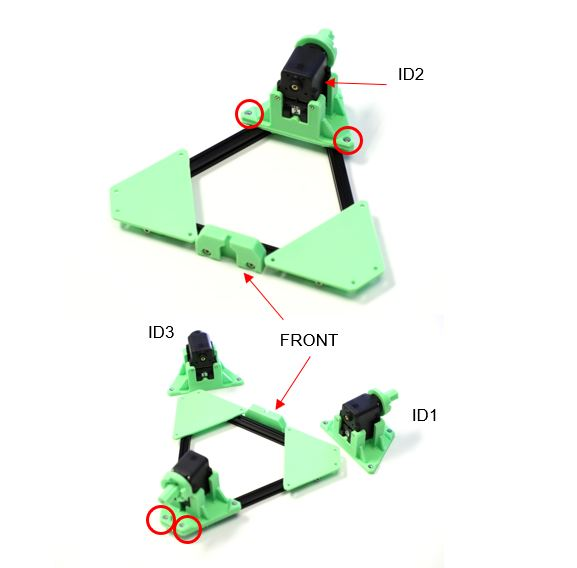

**8 Connect Motor Wiring**

-   When all of the Dynamixel MX-12W servo motors have been assigned IDs
    (see step 1) and have been installed in the proper locations,
    connect them for power and data transmission using the cables from
    the Dynamixel MX-12W motor kits.

    All servo motors share common power and data lines, and communicate
    using data packets addressed by motor ID. For this reason, they may
    be connected in any order, or even wired individually to the
    Dynamixel Power Hub. For cable management purposes the best
    connection order is 1 - 3 - 2.

    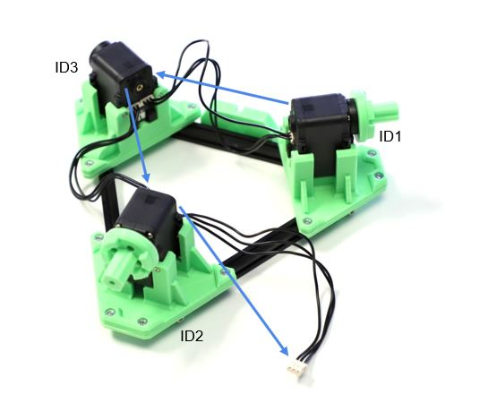

**9 Mount the IMU**

1.  Solder male header pins to the IMU board. Arrange them with long
    ends on the labelled side of the board. Pins for 3V3, GND, SCL, and
    SDA will be used for I2C communication.
2.  Mount the IMU board with header pins facing towards the center of
    the electronics bay (Kaya\_Electronics\_Bay) using 2 M2 x 6mm
    screws, as shown.

> 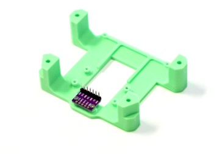

**10 Mount DC Regulators**

1.  Solder the blue screw terminals to the Pololu 5V 6A DC-DC Step-Down
    Regulator.
2.  Fasten the 5V regulator and 12V regulator to the electronics bay
    (Kaya\_Electronics\_Bay) with 6 M2 x 6mm screws. Ensure the
    orientation of these regulators matches the image, with IN+/- on the
    5V regulator on the same side as IN+/- on the 12V regulator.

    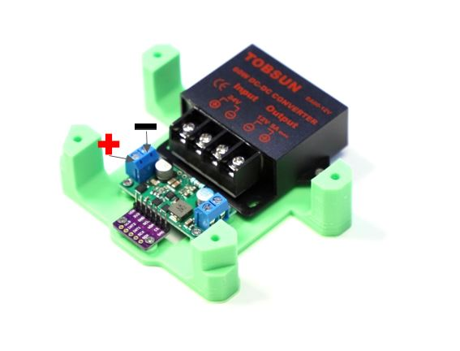

**11 Connect IMU Wiring**

1.  Attach female-to-female electrical jumper wires to IMU leads (3V3,
    GND, SCL, and SDA). Make note of what color wires are attached to
    each pin, these will later be connected to the Jetson Nano GPIO
    pins.
2.  Optionally, use a dab of hot glue on the middle side of the headers
    to hold to the IMU pin headers firmly in place.

    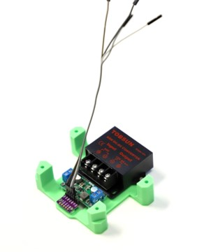

See [Wire the BMI160 IMU to the Jetson Nano or Xavier](wire_bmi160_imu.md) for more information.

**12 Install Wi-Fi Antennas**

1.  Connect the antenna cables to the Wi-Fi antennas using the SMA screw
    terminal.
2.  Bend antennas to 90 degrees, and fit them in the designated channels
    on either side of of the base (Kaya\_Nano\_Base).
3.  Fasten antennas in place using zip-ties, as shown.

    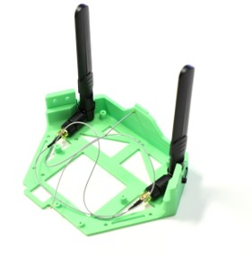

**13 Attach the Jetson Nano Base to the Frame**

1.  Orient the Jetson Nano Base (Kaya\_Nano\_Base) so that the NVIDIA
    logo faces the Kaya pusher mount (Kaya\_Pusher\_Mount).
2.  Slide 1 MakerBeam nut onto the top of the front MakerBeam, and 2
    onto the other two MakerBeams. Fasten the front screw first, then
    position the other 4 down to side beams. Tighten all screws evenly.

    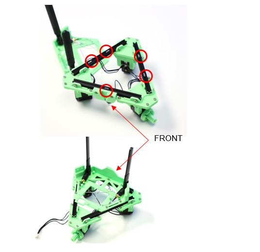

**14 Connect the Battery Chassis Assembly to the New Frame Assembly**

1.  Stack the electronics bay (Kaya\_Electronics\_Bay) on top of the
    battery holder (Kaya\_Battery\_Holder) with the flat faces together,
    DC regulators face-up.
2.  Bring the top of the electronics bay (Kaya\_Electronics\_Bay) into
    contact with the bottom of the base (Kaya\_Nano\_Base), so that it
    sits in the center of the frame assembly, between the motors.
3.  Ensure that no cables are being pinched. Check that the front
    dynamixel cables are not on top of the 12V power supply. Then attach
    using 4 M3 x 35mm screws down through the base (Kaya\_Nano\_Base)
    and into 4 M3 nuts in the battery holder (Kaya\_Battery\_Holder).

    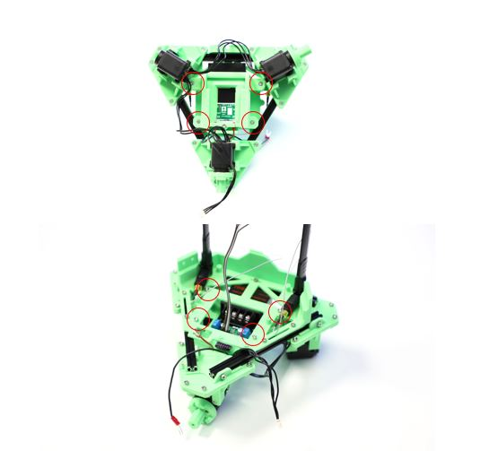

**15 Prepare the Terminal Block**

-   Usinge terminal block jumpers, join the two leftmost terminal block
    connections together, then the two rightmost connections. This
    allows battery B+ and B- to be routed to the 12V and 5V DC
    regulators.

    Reference the Wiring Diagram when making electrical connections as
    outlined in the following steps.

    

**16 Install the Power Switch**

1.  Locate the B+ wire (\#2, Red) from the battery holder, and feed it
    through the switch hole at the rear of of the base
    (Kaya\_Nano\_Base). Connect the female spade connector to the middle
    switch terminal.
2.  Attach a second wire (\#3, Red, female spade to fork spade) to the
    outer switch terminal.
3.  Orient the switch so that the two terminals are closest to the
    inside of Kaya. Slightly bend the connected terminal wires to face
    the outside of Kaya as in the image. This helps them to clear the
    battery holder (Kaya\_Battery\_Holder) once installed.
4.  Feed the unattached fork spade connector through the switch hole and
    toward the rear of Kaya.
5.  Being careful to avoid pinched wires, snap the switch down into
    place.

    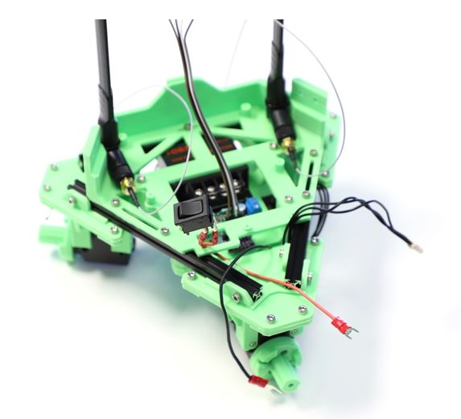

**17 Connect Regulator Inputs**

1.  Pull the B- wire (\#1, Black) from the battery and the B+ wire from
    the switch (\#3, Red) to the rear of Kaya. Connect the fork spade
    connectors of these wires to the terminal block, referencing the
    Wiring Diagram. These wires should route neatly between the
    MakerBeams below the terminal block.

    

2.  Connect wires \#4 through \#7 to the terminal block using fork spade
    connectors. Reference photos and the Wiring Diagram for cable
    order. Bend the forks downward after they are connected onto the
    terminal block for a better fit.

    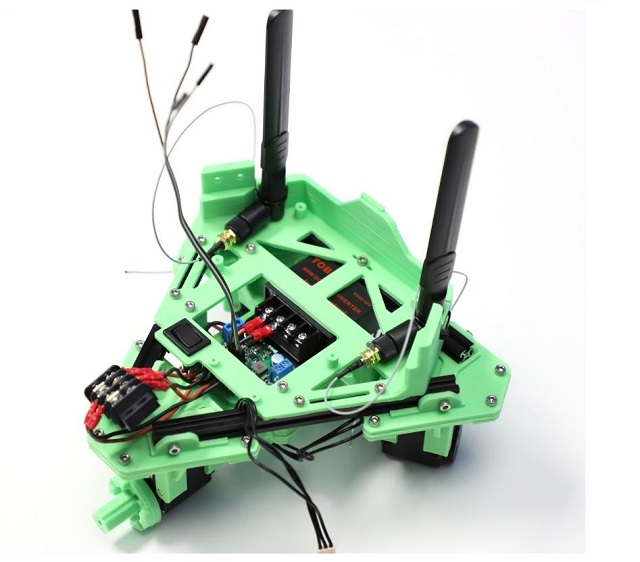

3.  Tuck the other cables underneath the base (Kaya\_Nano\_Base) and
    into the electronics bay (Kaya\_Electronics\_Bay). Connect cables
    \#4 and \#5 to the 12V regulator IN+/-, and cables \#6 and \#7 to
    the 5V regulator IN+/-. Note that the connections on the 12V
    regulator are ordered +IN, -IN, -OUT, +OUT, as indicated in the
    Wiring Diagram.

**18 Connect Regulator Outputs**

1.  Attach a 2.1 x 5.5mm male barrel plug pigtail to the 5V regulator
    out screw terminals. Note that the Brown wire is +, and the Blue
    wire is -. (Center positive polarity.)
2.  Connect the fork spade connectors of cables \#8 and \#9 to the 12V
    regulator OUT- and OUT+. Connect bare wire ends to the Dynamixel
    Power Hub screw terminals, routing the cables either back through or
    around the base (Kaya\_Nano\_Base).

    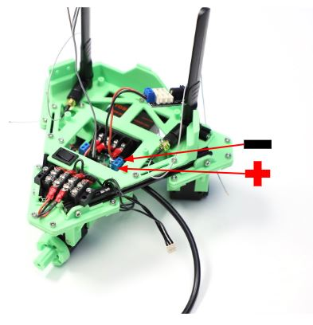

**19 Mount the Terminal Block**

1.  Mount the terminal block to the frame with 3 MakerBeam nuts and 2 M3
    x 8mm screws. Slide one extra nut ahead of right side of terminal
    block for later use with the terminal block cover
    (Kaya\_Terminal\_Block\_Cover).
2.  Position the Terminal Block as far back as possible by using only
    the front set of mounting holes.

    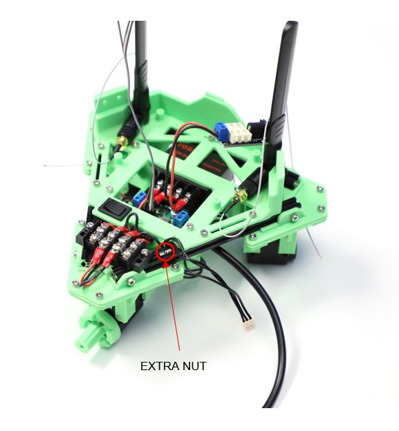

**20 Mount the Dynamixel Power Hub**

1.  Connect the loose Dynamixel cable from servo motor ID3 to any port
    on the Dynamixel Power Hub.
2.  Use another Dynamixel cable to connect the USB2AX to the Dynamixel
    Power Hub. Mount the Dynamixel Power Hub to the base
    (Kaya\_Nano\_Base) with 2 M2x6 screws, as shown below.

    

**21 Connect the Wi-Fi Card**

-   Connect the small antenna cable connectors (U.FL / AMC / UMCC / IPX)
    to the Wi-Fi card. These should snap into place with vertical
    pressure, but can be difficult to work with. It may be helpful to
    lay the card on a flat surface for best leverage. Take care not to
    damage the connectors on the card, and avoid disconnecting and
    reconnecting if possible.

    > 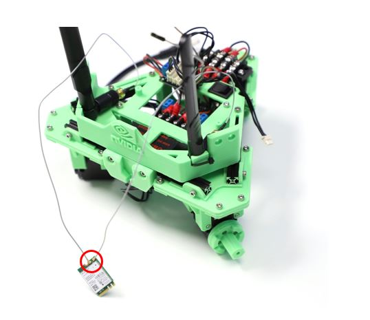

**22 Install the Wi-Fi Card**

1.  Remove the Jetson Nano module from the carrier board by first
    removing 2 Phillips screws, then the 2 side latches.
2.  Connect the Wi-Fi card and secure with the included screw.

> 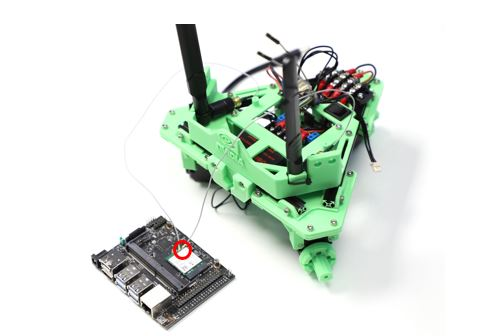

1.  Reattach and secure the Jetson Nano module the carrier board.

**23 Mount the Jetson Nano**

1.  Mount the Jetson Nano Developer Kit to Kaya\_Nano\_Base using 4 M2 x
    6mm screws, as shown in the image below. For cable management, it
    may be helpful to coil the antenna cables beneath the Jetson Nano.
2.  Add a jumper across the header pins labeled “ADD JMPR TO DISABLE USB
    PWR” on the carrier board to allow the Jetson Nano to be powered via
    the 5V barrel jack connection.

> 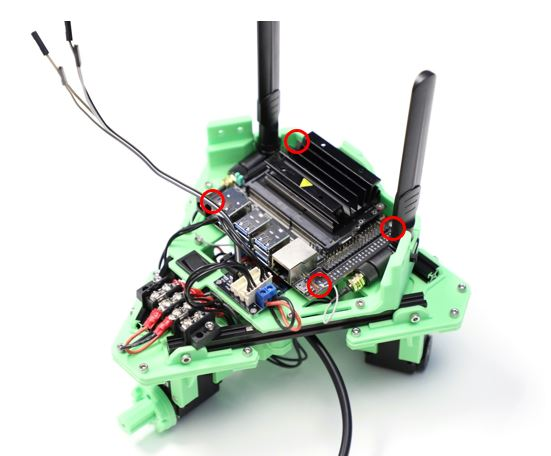

**24 Mount RealSense Camera**

1.  Attach the RealSense camera to Kaya\_Realsense\_Mount with 2 M3 x
    5mm screws.
2.  Use 3 M3 x 8mm screws and 3 M3 nuts to attach the camera mount
    (Kaya\_Realsense\_Mount) to the camera bridge
    (Kaya\_Realsense\_Bridge).
3.  Connect the USB-C cable to the RealSense camera.

    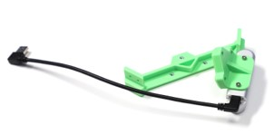

    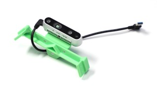

**25 Attach the RealSense Bridge to the Jetson Nano Base**

-   Use 4 M3 x 8mm and 4 M3 nuts to attach the camera bridge
    (Kaya\_Realsense\_Bridge) to the base (Kaya\_Nano\_Base).

    > 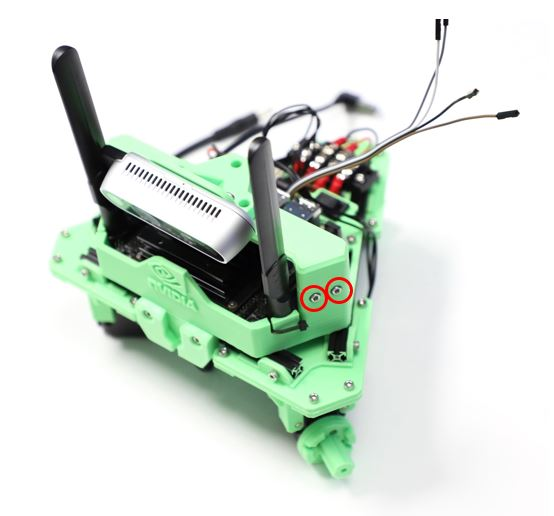

**26 Mount the Wheels**

-   Attach each Omniwheel using 1 M3 x 35mm screw through the outside
    wheel hub (Kaya\_Wheel\_Hub\_Outside), the wheel itself, and then
    into the inside hub (Kaya\_Wheel\_Hub\_Inside). Take care not to
    overtighten.

    Threadlocker may be used to prevent loosening of these fasteners.

    > 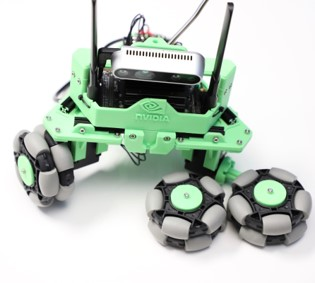

**27 Attach the Terminal Block Cover**

-   Using the extra MakerBeam nut from step 19, attach the terminal
    block cover (Kaya\_Terminal\_Block\_Cover) using a M3 x 5mm screw.

    > 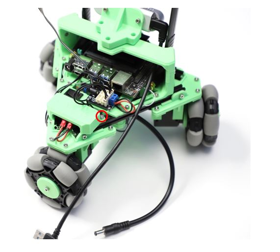

**28 Connect Cables to Jetson Nano**

1.  Connect the RealSense camera and USB2AX to the top 2 USB connectors
    on the Nano.
2.  Ensure the power switch is **not** set to “ON”.
3.  Route the barrel plug cable from the 5V regulator behind the
    terminal block cover (Kaya\_Terminal\_Block\_Cover) and plug into
    the barrel jack input of Jetson Nano.

    **Never connect the 5V barrel plug cable to the barrel jack input of
    the Dynamixel Power Hub.** This may cause irreversible damage to the
    voltage regulators.

4.  Connect the jumper wires from the IMU to the Jetson Nano GPIO pins,
    referencing the Wiring Diagram and your earlier notes on wire
    colors.

    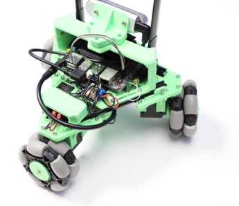

**29 Clean Up Cables and Power On**

1.  Tuck the front Dynamixel cables up in front of 12V regulator and
    MakerBeam.
2.  Zip-tie other Dynamixel and power supply cables as desired.
3.  Install Battery and ensure it snaps into place. If there is
    resistance, check for cables and any remaining 3D printed support
    material, then ensure your terminals are not bent.
4.  Install the pusher (Kaya\_Pusher) by sliding it down into the pusher
    mount (Kaya\_Pusher\_Mount).

    Congratulations, you have fully assembled a Kaya robot! Have fun
    tinkering with your new creation and the Isaac Robot Engine!

    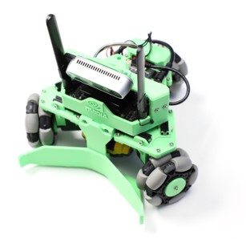

Notes on Power-Hungry Applications
----------------------------------

You may encounter issues when running more demanding applications on
Jetson Nano, especially when running in “MAX-N” mode.

Be careful that 3D printed PLA plastic parts do not come into contact
with the heatsink if there are concerns with Jetson Nano overheating.
Kaya is not equipped with a fan to aid with cooling. The Jetson Nano
Developer Kit provides a 4-pin connector to accommodate 5V PWM fans.
However, adding a fan to Kaya requires removal or custom modification of
several 3D printed parts.

Raising the nominal output voltage of the 5V regulator can help
safeguard against the effects of transient voltage dips. This can be
accomplished by soldering a thru-hole resistor between the FB and GND
pins on the Pololu 5V regulator board. A resistor value of 82.5 kOhm
increases the nominal output voltage to 5.143V.

> 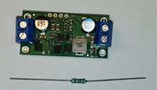

The following image shows the resistor correctly installed.

> 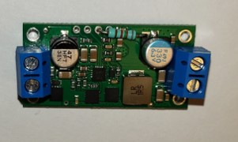

A capacitor (100-1000 uF) may also be placed across the regulator output
terminals to further safeguard against transient voltage fluctuations.
For more information, please reference the datasheet for the Microchip
MIC2101.

Running Isaac SDK on Kaya
-------------------------

Once you have assembled a your Kaya, use the procedures in
[How to Get Started with Jetson Nano](nano.md) get started with Isaac on the Jetson Nano, and deploy
and run a couple of sample applications.

The Joystick Application
------------------------

The following steps deploy a simple joystick application that can be
used to control the Kaya robot.

1.  On the desktop system where the Isaac SDK is installed, enter the
    following command:

        ./engine/build/deploy.sh -d jetpack42 -h <nano_ip> -p //apps/kaya:joystick-pkg

2.  Change to the directory on your Nano and run the application with
    the following commands:

        cd deploy/<your_username>/joystick-pkg/
        ./apps/kaya/joystick

The Follow Me Application
-------------------------

The following steps deploy an application to have the Kaya robot
autonomously move towards a designated AprilTag fiducial. This
application combines AprilTag detection, path planning, control, and the
Kaya driver. It requires a working realsense camera for AprilTag
detection and path planning, and a joystick to enable autonomous mode.

1.  On the desktop system where the Isaac SDK is installed, enter the
    following command:

        ./engine/build/deploy.sh -d jetpack42 -h <nano_ip> -p //apps/kaya:follow_me-pkg

    Where &lt;nano\_ip&gt; is the IP address of the Jetson Nano on the
    robot.

2.  Change to the directory on your Nano and run the application with
    the following commands:

        cd deploy/<your_username>/follow_me-pkg/
        ./apps/kaya/follow_me

3.  Open Isaac Sight on the desktop browser at &lt;nano\_ip&gt;:3000. In
    the Application Configuration panel on the right, click on
    fiducial\_as\_goal, and change the target\_fiducial\_id (default is
    "tag36h11\_9") to the id of the AprilTag in use.

    If you put the AprilTag within the realsense camera's field of view,
    you should see in the Follower Kaya - Camera window that the april
    tag is detected, and a planned path shown in a blue line from the
    Kaya robot to the april tag.

4.  If you hold down the R1 button on the joystick, the Kaya robot
    enters autonomous mode, and moves towards the april tag. Move the
    april tag around while keeping it within the camera's view, and Kaya
    follows it around.

The Object Detection Application
--------------------------------

This application uses YOLO (tiny-yolov3) on Kaya to perform object
detection. The YOLO model is trained to recognize a few common objects
in these three classes for trash classification: compost (apple,
banana), metal (soda can), paper (paper box and small cardboard box).
Here are the steps for running this application.

1.  On the desktop system where the Isaac SDK is installed, enter the
    following command:

        ./engine/build/deploy.sh -d jetpack42 -h <nano_ip> -p //apps/kaya:object_detection-pkg

2.  Change to the directory on your Nano and run the application with
    the following commands:

        cd deploy/<your_username>/object_detection-pkg/
        ./apps/kaya/object_detection_kaya

    Open Isaac Sight on the desktop browser at &lt;nano\_ip&gt;:3000.
    You should be able to see the live camera image.

3.  Place an apple or a soda can in front of Kaya's camera, and you
    should see a bounding box around the object labeled as compost or
    metal, respectively.

The Mapping Application
-----------------------

The gmapping application demonstrates use of the Kaya robot to build an
occupancy map of its environment. Kaya uses the Intel RealSense camera
to perceive depth of obstacles, and wheel odometry and IMU to update its
own state. Obstacle depth and robot state information are published to
the host to build up a map.

This application has two parts: gmapping\_distributed\_kaya that runs on
the Kaya robot, and gmapping\_distributed\_host that runs on the host
machine.

1.  On the desktop system where the Isaac SDK is installed, enter the
    following command:

        ./engine/build/deploy.sh -d jetpack42 -h <nano_ip> -p //apps/kaya:gmapping_distributed_kaya-pkg

2.  Change to the directory on your Nano and run the application with
    the following commands:

        cd deploy/<your_username>/gmapping_distributed_kaya-pkg/
        ./apps/kaya/gmapping_distributed_kaya

    Open Isaac Sight on the desktop browser at &lt;nano\_ip&gt;:3000.
    You should be able to see the camera RGB and depth image, as well as
    plot of the robot state.

3.  Use the joystick to drive Kaya around and you should see the robot
    state being updated.
4.  On the desktop system, open
    app/kaya/gmapping\_distributed\_host.app.json and change the
    tcp-subscriber host from "YOUR\_NANO\_IP\_HERE" to the IP address of
    the Jetson Nano on the robot (&lt;nano\_ip&gt;).
5.  Build and run the host application with the following commands:

        bazel build //apps/kaya:gmapping_distributed_host
        bazel run //apps/kaya:gmapping_distributed_host

6.  Open Isaac Sight on the desktop at localhost:3000. You should be
    able to see the map Kaya is building. Use the joystick to drive Kaya
    around and observe the map updates.

    If you see performance issues with the map update, go to the Kaya
    page of Isaac Sight webpage and disable camera RGB and depth
    visualization (uncheck Channels - viewer).

IMU and Motor Permissions
-------------------------

Kaya uses an IMU that connects using I2C protocol and motors that are
connected through USB. Therefore the following commands need to be
executed on Nano once. Please start a new terminal after running these
commands.

    sudo adduser $USER dialout
    sudo adduser $USER i2c

For more information on the IMU, see the [Wire the BMI160 IMU to the Jetson Nano or Xavier](wire_bmi160_imu.md) section of this
document.
