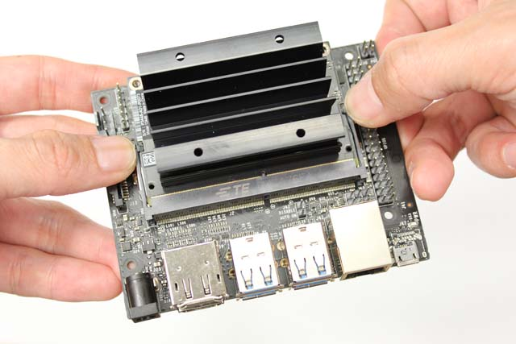
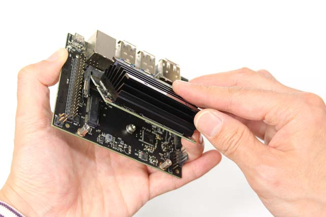
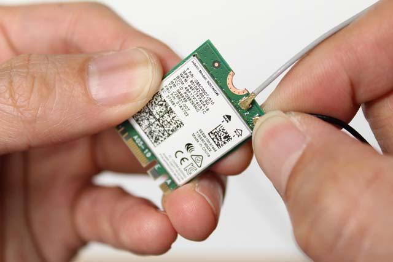
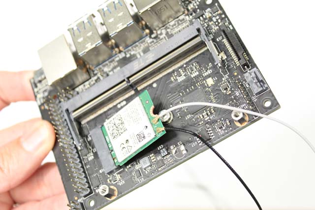

How to Get Started With Jetson Nano
===================================

This section describes how to flash, install wireless connectivity, and
run Isaac SDK sample applications on the Jetson Nano device. To get
started with Nano in general, from the very beginning, see [Getting
Started with Jetson Nano Developer
Kit](https://developer.nvidia.com/embedded/learn/get-started-jetson-nano-devkit).

How to Flash Jetson Nano
------------------------

Nano can be flashed in two ways:

-   Via an SD Card: See the procedures in [Getting Started with Jetson
    Nano Developer
    Kit](https://developer.nvidia.com/embedded/learn/get-started-jetson-nano-devkit).
-   Via SDK Manager: See the procedures in [SDK Manager User
    Guide](https://docs.nvidia.com/sdk-manager)

Use those documents to determine the best method for your use case.

Connecting a Wi-Fi/Bluetooth Card
---------------------------------

The Intel 8265 is used for Wi-Fi and Bluetooth connectivity. Use the
following steps to install a Wi-Fi/Bluetooth card for Jetson Nano.

1.  To access the M.2 slot on the carrier board, remove the two screws
    on the side and open the SODIMM latches using both your hands.

    

2.  When the Jetson Nano module pops up, slide it out gently.

    

3.  Take out the Intel wireless card, attach antenna on its U.FL sockets
    before inserting the card to the M.2 socket. Attaching the antena on
    the sockets requires a patience and getting used to. Use your nail
    to gently apply a force. You don't need that much force to clamp
    that in once you are in the right position.

    

4.  Slide the Intel 8265 card into the socket.

    

5.  Fix the Intel 8265 card in place with a screw, and replace the
    Jeston Nano module. Make sure to use the correct screws in each
    case.

    

Getting the IP Address
----------------------

Obtain the IP address of Jetson Nano with the following steps:

1.  If necessary, connect a keyboard, mouse, and display, and boot the
    device as shown in the [Setup and First
    Boot](https://developer.nvidia.com/embedded/learn/get-started-jetson-nano-devkit#setup)
    section of Getting Started with Jetson Nano Developer Kit.
2.  At a terminal prompt, enter the following command:

        bob@jetson:~/$ ip addr show

Sample Applications to Run on Jetson Nano
-----------------------------------------

This section describes the steps to run two sample applications on
Jetson Nano. The first does not require any peripherals. The second one
is a more useful application that requires a camera to be connected.

Other applications can be also deployed and run using the methods
described here.

### Ping

1.  On the host system where the Isaac SDK is installed, start by typing
    the following on your host machine with Isaac SDK.

>     bob@desktop:~/isaac$ /engine/build/deploy.sh -d jetpack42 -h <nano_ip> -p //apps/tutorials/ping:ping-pkg
>
> You might need to use the --remote\_user USER flag if the user name on
> the robot is not nvidia.

1.  Change to the directory on your Jetson Nano and run the application
    with the following commands:

>     bob@jetson:~/$ cd deploy/bob/ping-pkg/
>     bob@jetson:~/deploy/bob/ping-pkg$ ./apps/tutorials/ping/ping

Where "bob" is your username on the host system. You should see "Hello
World!" being printed every 1.5 seconds.

### OpenCV Edge Detection

1.  For this sample, connect a camera to one of the USB ports on the
    Jetson Nano.
2.  On the host system where the Isaac SDK is installed, type the
    following command:

>     bob@jetson:~/isaac$ ./engine/build/deploy.sh -d jetpack42 -h <nano_ip> -p //apps/tutorials/opencv_edge_detection:opencv_edge_detection-pkg
>
> You might need to use the --remote\_user USER flag if the user name on
> the robot is not nvidia.

1.  Change to the directory on your Jetson Nano and run the application
    with the following commands:

>     bob@jetson:~/$ cd deploy/bob/opencv_edge_detection-pkg/
>     bob@jetson:~/deploy/bob/opencv_edge_detection-pkg/$ ./apps/tutorials/opencv_edge_detection/opencv_edge_detection

1.  To view the results, load http://&lt;nano\_ip&gt;:3000/ in your
    browser. Make sure that the application is running when you are
    loading the webpage.

