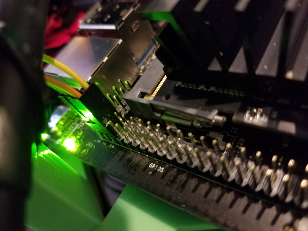
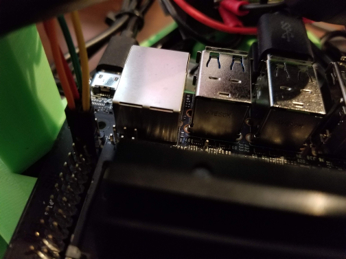
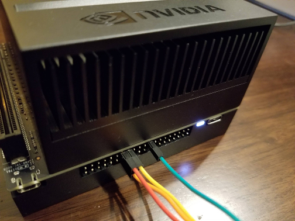

Wire the BMI160 IMU to the Jetson Nano or Xavier
================================================

The Bosch Sensortec BMI160 Inertial Measurement Unit attaches to the
Jetson board via the 40 pin GPIO Expansion Header. The IMU sample app is
configured to look for the BMI160 on I2C bus 1. Here are instructions on
how to wire the IMU to I2C bus 1.

Jetson Nano
-----------

From the BMI160 to the Jetson Nano 40 pin connector attach VIN to GPIO
1, GND to GPIO 6, SCL to GPIO 5, and SDA to GPIO 3.

<table style="width:25%;">
<colgroup>
<col width="12%" />
<col width="12%" />
</colgroup>
<thead>
<tr class="header">
<th>BMI160</th>
<th>GPIO</th>
</tr>
</thead>
<tbody>
<tr class="odd">
<td>VIN</td>
<td><blockquote>

1

</blockquote></td>
</tr>
<tr class="even">
<td>GND</td>
<td><blockquote>

6

</blockquote></td>
</tr>
<tr class="odd">
<td>SCL</td>
<td><blockquote>

5

</blockquote></td>
</tr>
<tr class="even">
<td>SDA</td>
<td><blockquote>

3

</blockquote></td>
</tr>
</tbody>
</table>

It is a little hard to see the wiring in these photos since the Nano is
attached to a robot, so multiple photos are included.

Wiring:

    Green wire:  VIN => GPIO 1
    Red wire:    SDA => GPIO 3
    Orange wire: SCL => GPIO 5
    Yellow wire: GND => GPIO 6

Jetson Xavier
-------------

From the BMI160 to the Jetson Xavier 40 pin connector attach VIN to GPIO
17, GND to GPIO 25, SCL to GPIO 28, and SDA to GPIO 27.

<table style="width:25%;">
<colgroup>
<col width="12%" />
<col width="12%" />
</colgroup>
<thead>
<tr class="header">
<th>BMI160</th>
<th>GPIO</th>
</tr>
</thead>
<tbody>
<tr class="odd">
<td>VIN</td>
<td><blockquote>

17

</blockquote></td>
</tr>
<tr class="even">
<td>GND</td>
<td><blockquote>

25

</blockquote></td>
</tr>
<tr class="odd">
<td>SCL</td>
<td><blockquote>

28

</blockquote></td>
</tr>
<tr class="even">
<td>SDA</td>
<td><blockquote>

27

</blockquote></td>
</tr>
</tbody>
</table>

Wiring:

    Green wire:  VIN => GPIO 17
    Yellow wire: GND => GPIO 25
    Red wire:    SDA => GPIO 27
    Orange wire: SCL => GPIO 28

User Permissions
----------------

On the Jetson, `/dev/i2c-*` is owned by the user `root`, and are in the
group `i2c`. The sample app will need to run as either root, or by a
user in the i2c group.

To add the current user to the i2c group, use the following command:

    sudo usermod -a -G i2c $USER
